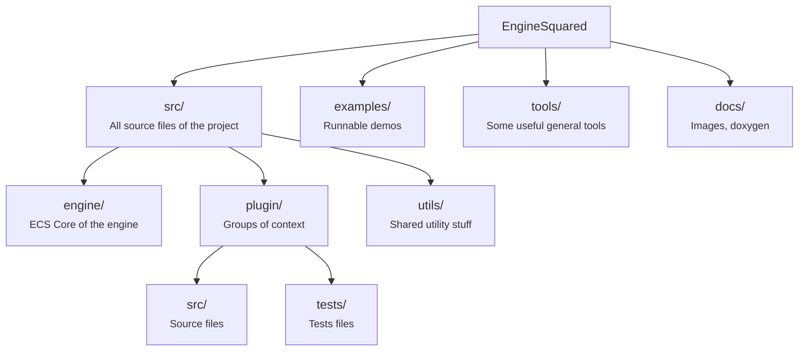

# Engine² (or Engine Squared)

[](https://github.com/EngineSquared/EngineSquared/actions/workflows/ci.yml)
[](LICENSE)
[](https://github.com/EngineSquared/EngineSquared/releases)
[](https://github.com/EngineSquared/EngineSquared/issues)
[](https://github.com/EngineSquared/EngineSquared/stargazers)

Engine² is a game engine that aims to provide a developer-friendly and open-source alternative for 3D game development.
It is designed to provide truly open-source project and be accessible to everyone.

---
## Examples

<div align="center">
<a href="https://github.com/EngineSquared/ES-RS"></a>
<a href="https://github.com/EngineSquared/ES-RS"></a> <br />
<a href="https://github.com/EngineSquared/EngineSquared/tree/main/examples/graphic_light_usage"></a>
<a href="https://github.com/EngineSquared/EngineSquared/tree/main/examples/graphic_material_usage"></a> <br />
</div>
---
## Prerequisites

Make sure the following tools are installed before proceeding:

| Tool                         | Minimum version | Install                                                               |
| ---------------------------- | --------------- | --------------------------------------------------------------------- |
| [xmake](https://xmake.io/#/) | v3.0.x          | See [xmake installation guide](https://xmake.io/#/guide/installation) |

> [!WARNING]
> No other tools should be needed. If you get stuck at some step, please report it by opening a [bug issue](https://github.com/EngineSquared/EngineSquared/issues/new?template=bug_report.md) 🙏
> *(before doing that, check the documentation about [how to create an issue](https://github.com/EngineSquared/EngineSquared/wiki/Contributing#creating-an-issue))*

---
## Clone the repository

```bash
git clone https://github.com/EngineSquared/EngineSquared.git
cd EngineSquared
```

---

## Configure and build

```bash
# Configure (downloads dependencies automatically)
xmake f -y

# Build the engine
xmake build -y
```

> [!NOTE]
> **Windows only**
> xmake will automatically pull the MSVC toolchain, so you don't need to have it already installed on your machine.

---
## Run a minimal example

Build and run the `basic_core_usage` example to confirm everything works:

```bash
xmake f --basic_core_usage=y -y
xmake run BasicCoreUsage
```

If the basic core usage run without errors, you're all set. ✅

---
## Project Overview

Here is a graphical overview of the project:



Engine² is **STRONGLY** built around an [ECS architectural design pattern](https://en.wikipedia.org/wiki/Entity_component_system). The engine core (`src/engine/`) provides all necessary stuff to agglomerate logic and data to create any kind project. The Core class is the entry point of the framework, it allows to manipulate entities and systems through schedulers. All features (graphics, physics, sound, etc.) are implemented as **plugins** that you register into the engine core.


### Available plugins

Here is a list of available plugins:

| Plugin               | Description                           |
| -------------------- | ------------------------------------- |
| `graphic`            | 3D rendering via WebGPU               |
| `physics`            | Rigid body physics via JoltPhysics    |
| `input`              | Keyboard/mouse input via GLFW         |
| `sound`              | Audio playback via miniaudio          |
| `window`             | Window management via GLFW            |
| `scene`              | Scene graph management                |
| `event`              | Publish/subscribe event system        |
| `relationship`       | Parent/child entity relationships     |
| `native-scripting`   | Attach C++ scripts to entities        |
| `rmlui`              | UI rendering via RmlUi                |
| `camera-movement`    | Built-in camera controller            |
| `rendering-pipeline` | Rendering pipeline abstraction        |
| `default-pipeline`   | Pre-assembled default render pipeline |

> [!WARNING]
> Those schedulers may not be up to date as they are not updated automatically.

---
### How a minimal program looks

Here is a very basic example that can be useful to understand the pattern before contributing:

```cpp
#include "Engine.hpp"

// A Component should only holds data related to an entity
struct NameComponent { std::string value; };

// A System is a callable element (function, class or lambda) that only run logic
void HelloSystem(Engine::Core &core) {
    core.GetRegistry().view<NameComponent>().each(
        [](auto &name) { Log::Info(name.value + " arrived."); });
}

int main() {
    Engine::Core core;

    // Register systems on lifecycle schedulers: Startup, Update or Shutdown
    core.RegisterSystem<Engine::Scheduler::Startup>(HelloSystem);

    // Create entities and attach components
    auto entity = core.CreateEntity();
    entity.AddComponent<NameComponent>("Alice");

    core.RunSystems(); // starts the game loop, RunSystems() run them only one time and RunCore() run all scheduler indefinitely until Stop() is called
}
```

> [!WARNING]
> This example may not be up to date as it's not updated automatically. For concrete working examples, you can check [examples folder](https://github.com/EngineSquared/EngineSquared/tree/main/examples).

---
## Where to go next

- 📚 [Full documentation & wiki](https://github.com/EngineSquared/EngineSquared/wiki): everything you need to know to understand the project
- 💻 [Technical documentation](https://enginesquared.github.io/EngineSquared/):  if you want to get in depth in the engine
- 🧩 [All examples](https://github.com/EngineSquared/EngineSquared/tree/main/examples): explore graphics, physics, input, sound, and more
- 🤝 [Contributing guide](https://github.com/EngineSquared/EngineSquared/wiki/Contributing): how to contribute to the project
- 👮‍♀️[Code of conduct](https://github.com/EngineSquared/EngineSquared/blob/main/CODE_OF_CONDUCT.md): how you should behave while interacting in this community
- 🧪 Run the test suite: `xmake test -y`
- 🗺️ [Roadmap](https://github.com/orgs/EngineSquared/projects/4/views/1): what are we currently doing

---
## Interested ? 

You can start to discover the engine through contribute to it through looking at [good first issues](https://github.com/EngineSquared/EngineSquared/issues?q=is%3Aissue%20state%3Aopen%20label%3Agood-first-issue) and checking [how to contribute](https://github.com/EngineSquared/EngineSquared/wiki/Contributing)

---
## Troubleshooting

For now there is no troubleshooting found. If you encounter a problem, please report it by opening a [question issue](https://github.com/EngineSquared/EngineSquared/issues/new?template=question.md) 🙏
*(before doing that, check the documentation about [how to create an issue](https://github.com/EngineSquared/EngineSquared/wiki/Contributing#creating-an-issue))*
