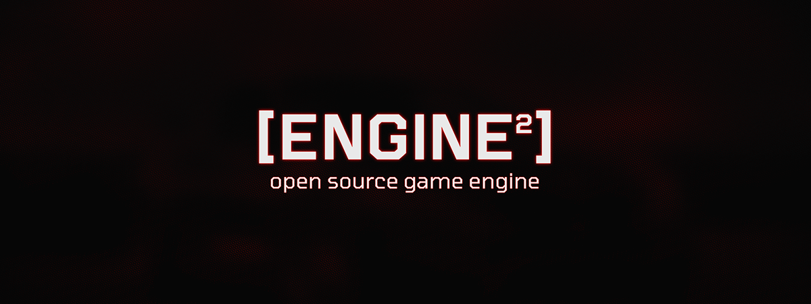
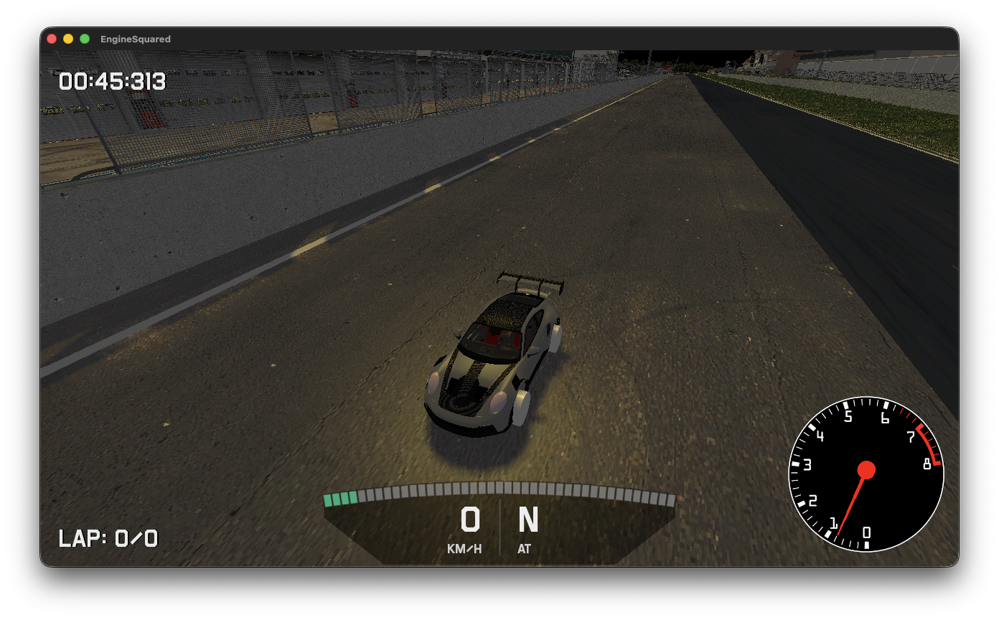
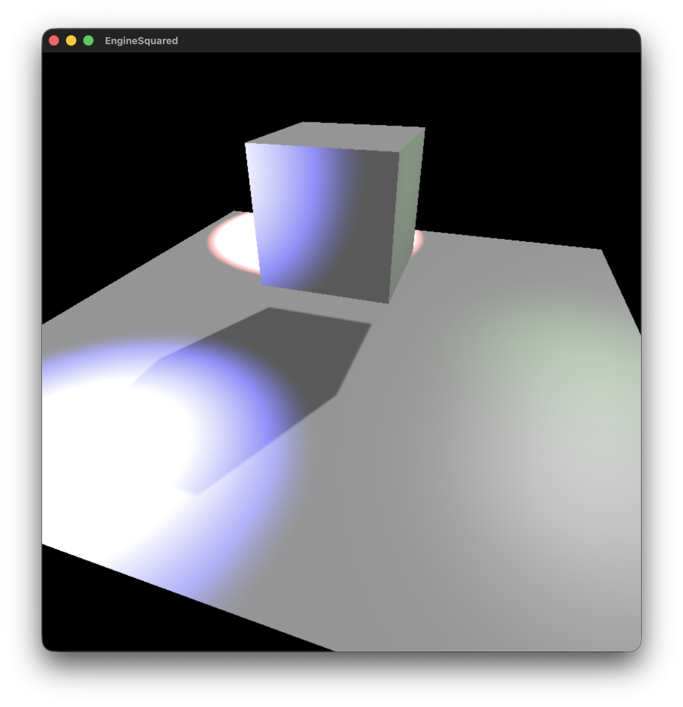
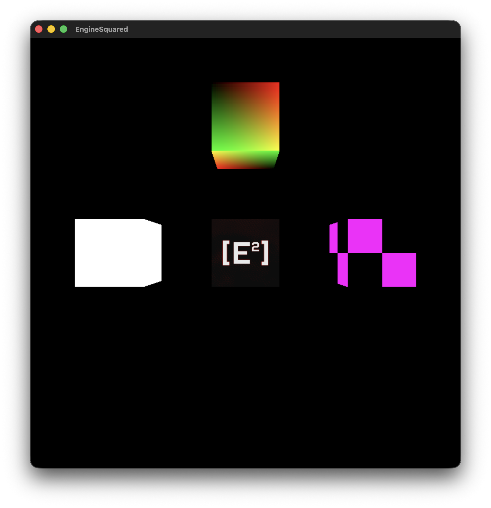

# Engine² (or Engine Squared)

[](https://github.com/EngineSquared/EngineSquared/actions/workflows/ci.yml)
[](LICENSE)
[](https://github.com/EngineSquared/EngineSquared/releases)
[](https://github.com/EngineSquared/EngineSquared/issues)
[](https://github.com/EngineSquared/EngineSquared/stargazers)

Open-source game engine written in C++.
<br>

## Description

Engine² is a game engine that aims to provide a developer-friendly and open-source alternative for 3D game development.
It is designed to provide truly open-source project and be accessible to everyone.

## Examples

<div align="center">
<a href="https://github.com/EngineSquared/ES-RS"></a>
<a href="https://github.com/EngineSquared/ES-RS"></a> <br />
<a href="https://github.com/EngineSquared/EngineSquared/tree/main/examples/graphic_light_usage"></a>
<a href="https://github.com/EngineSquared/EngineSquared/tree/main/examples/graphic_material_usage"></a> <br />
</div>

## Getting started

### Requirements

- [Xmake](https://xmake.io/#/)

### Compile the library

1. Run `xmake build`
2. Install required dependencies if needed (or use `xmake build -y` to install them automatically)

## Run unit tests

1. Run `xmake test`
2. Install required dependencies if needed (or use `xmake test -y` to install them automatically)
3. Tests will be executed individually

### Apply the coding style

For bash users, you can use the following command to apply the coding style to the project:
```bash
find . -iname '*.hpp' -o -iname '*.cpp' | xargs clang-format -i
```

For Windows users, you can use the following command to apply the coding style to the project:
```powershell
Get-ChildItem -Recurse -Include *.cpp, *.hpp | ForEach-Object { clang-format -i $_.FullName }
```

For Visual Studio users, you can use the [ClangFormat extension](https://marketplace.visualstudio.com/items?itemName=LLVMExtensions.ClangFormat) to format the code.

## Documentation

The documentation is available at [https://github.com/EngineSquared/EngineSquared/wiki](https://github.com/EngineSquared/EngineSquared/wiki).

## Code of Conduct

Please note that this project is released with a [Code of Conduct](CODE_OF_CONDUCT.md). By participating in this project you agree to abide by its terms.
